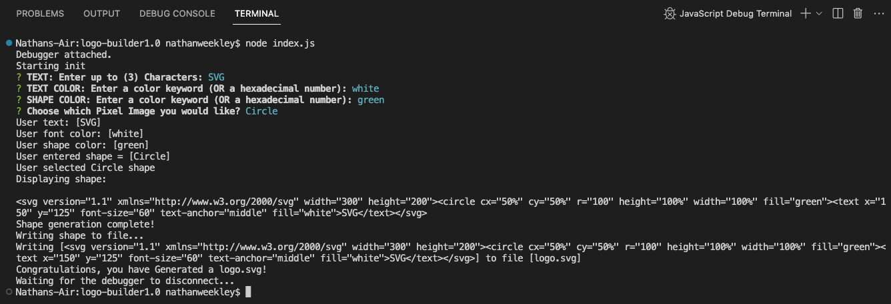
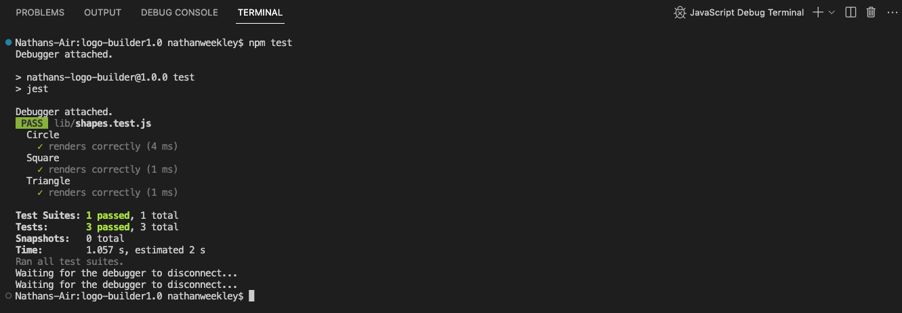

# Nathan's Logo Builder v1.0

[](https://opensource.org/licenses/MIT)
  
## Description:
Enables the user to enter inputs from an inquirer prompt in order to generate a logo or "logo.svg" file which contains the users desired results as an SVG image.

## Table of Contents:
- [Overview](#Overview)
- [The Challenge](#The-Challenge)
- [Usage Information](#Usage-Information)
- [Installation Process](#Installation-Process)
- [Built With](#Built-With)
- [What I Learned](#What-I-Learned)
- [Continued Development](#Continued-Development)
- [License](#License)
- [Author](#Author)
- [Acknowledgments](#Acknowledgments)

# Overview

## The Challenge:
Build a Node.js command-line application that takes in user inputs to generates a SVG logo and saves it as "logo.svg" file. In addition, create a walkthrough video that demonstrates its functionality and the passing of all of the tests via Jest.


## User Story
```md
AS a freelance web developer
I WANT to generate a simple logo for my projects
SO THAT I don't have to pay a graphic designer
```

## Acceptance Criteria
```md
GIVEN a command-line application that accepts user input
WHEN I am prompted for text
THEN I can enter up to three characters
WHEN I am prompted for the text color
THEN I can enter a color keyword (OR a hexadecimal number)
WHEN I am prompted for a shape
THEN I am presented with a list of shapes to choose from: circle, triangle, and square
WHEN I am prompted for the shape's color
THEN I can enter a color keyword (OR a hexadecimal number)
WHEN I have entered input for all the prompts
THEN an SVG file is created named `logo.svg`
AND the output text "Generated logo.svg" is printed in the command line
WHEN I open the `logo.svg` file in a browser
THEN I am shown a 300x200 pixel image that matches the criteria I entered
```

## Usage Instructions
1. Open the cloned repository in any source code editor e.g. Visual Studio Code.
2. Open the terminal on index.js
3. Enter “node index.js” in the command line
4. User will be presented with npm inquirer questions - the user will provide a response to each question and proceed.
5. Once completed a SVG file named "logo.svg" will be created.
6. You can rename the "logo.svg" file to the file name of your choice.

## Solution URL:
[Solution URL Link:](https://Nweekley84.github.io/logo-builder1.0)

## Video:
[Click Here to Watch]()

## Screenshots:
### Figure 1. Command line application
 
### Figure 2. Jest Testing "npm test"

### Figure 3. Generated "logo.svg" file


## Installation Process
1. Clone the repository: [Nathan's logo builder v1.0](https://Nweekley84.github.io/logo-builder1.0)
2. Install the following: 
- Node.JS [Version 16.18.1](https://nodejs.org/en/blog/release/v16.18.1/)
- Jest [Version 29.4.3](https://www.npmjs.com/package/jest)
- Inquirer.js: [Version 8.2.4](https://www.npmjs.com/package/inquirer/v/8.2.4)
3. Open the cloned repository in any source code editor.
4. Open the terminal for the document and complete the respective installation guides provided above in section (2.) to ensure the cloned documentation will operate.

## Built With
- Dynamic JavaScript
- Node.js [Version 16.18.1](https://nodejs.org/en/blog/release/v16.18.1/)
- Jest [Version 29.4.3](https://www.npmjs.com/package/jest)
- Inquirer.js: [Version 8.2.4](https://www.npmjs.com/package/inquirer/v/8.2.4)
- License Badge: [Shields.io](https://shields.io/)
- Visual Studio Code: [Website](https://code.visualstudio.com/)

## What I Learned
- I Learned the JavaScript testing framework for "Jest".
### Continued Development:
1. Add more user prompts to create more options for the SVG image.
## License & Copyright ©
  
[](https://opensource.org/licenses/MIT) [Open Source Initiative Link](https://opensource.org/licenses/MIT)

### Copyright © 2023 Nathan Weekley
```md
```

  
## Author

Follow me on Github at [NathanWeekley](https://github.com/Nweekley84)! Contact me at [nweekley27@gmail.com](nweekley27@gmail.com).

© 2023 [NathanWeekley](https://github.com/Nweekley84).